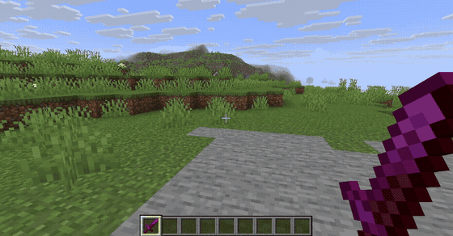

# ItemForge

**ItemForge** is a free, open-source custom item system for Paper Minecraft servers — an
alternative to [ItemsAdder](https://www.spigotmc.org/resources/itemsadder.73355/) and
[Oraxen](https://www.spigotmc.org/resources/oraxen.93107/) that doesn't require a paid
license. Define custom items, armor, crafting recipes, and blocks entirely through YAML
configuration files; ItemForge automatically generates and serves the resource pack and
handles the gameplay logic (abilities, cooldowns) at runtime.

- No purchase, license key, or account required.
- Custom textures via `CustomModelData` on servers below 1.21.4, and via the newer
  `item_model` component / Client Items system on 1.21.4+ — handled automatically,
  same config either way.
- Built-in resource-pack hosting (no external file host needed).
- Balance analysis that tells you when a custom item is broken — permanent potion effects,
  missing cooldowns, gear that costs nothing to craft — with no API key needed.
- Optional AI-assisted item generation and an optional web dashboard, both off by default.



**[See it in action →](docs/showcase/README.md)** — items, armor, recipes, and blocks in game,
plus the dashboard, Texture Studio, balance analysis, and AI generation, in screenshots and GIFs.

## Compatibility

| Requirement | Value |
| --- | --- |
| Minimum Paper version | **1.20.5** (plugin is compiled to Java 21 bytecode; Paper only guarantees a Java 21 host from 1.20.5 onward) |
| Model rendering strategy | **Legacy** (`CustomModelData` + model `overrides`) below **1.21.4**; **Modern** (`item_model` component + standalone item model files) at/above **1.21.4** — selected automatically at startup, no configuration needed |
| Actively tested range | Paper 1.20.6 (legacy) through Paper 1.21.11 (modern) |
| Java | 21+ (bundled with any Paper build that supports 1.20.5+) |

There is no upper version ceiling enforced — new Paper releases above 1.21.4 keep using the
Modern strategy automatically.

## Installation

1. Download `itemforge-*.jar` from the [Releases](../../releases) page (or build it yourself:
   `mvn clean package`, jar appears in `target/`).
2. Copy the jar into your Paper server's `plugins/` directory.
3. Start (or restart) the server, then edit the generated `plugins/ItemForge/config.yml` as
   needed (see [Configuration](#configuration) below) and restart once more. Later changes to
   content files and to the `ai` section only need `/itemforge reload`.

> Prefer Docker? See the [Quick Docker Setup](#quick-docker-setup-optional) section near the
> bottom — it's an alternative to the 3 steps above, not a requirement.

## Configuration

ItemForge ships one config file for plugin settings and four YAML files for content, all
under `plugins/ItemForge/`. Every field below is taken from the plugin's real shipped
defaults, not a hypothetical example.

### `config.yml`

```yaml
resource-pack:
  # Public IP/domain Minecraft clients will connect to for the resource pack.
  # MUST be changed from CHANGE_ME before the resource pack is served.
  host: "CHANGE_ME"
  port: 8080

hud:
  # Ticks between BossBar cooldown progress updates (20 ticks = 1s).
  bossbar-update-interval-ticks: 5

ai:
  # Off by default: requires a real API key and costs money per /itemforge generate call.
  enabled: false
  provider: "claude"   # claude | chatgpt | deepseek | gemini
  claude:
    api-key: "CHANGE_ME"
    model: "claude-haiku-4-5"
    max-tokens: 2048
    timeout-seconds: 30
  chatgpt:
    api-key: "CHANGE_ME"
    model: "gpt-4o-mini"
    max-tokens: 2048
    timeout-seconds: 30
  deepseek:
    api-key: "CHANGE_ME"
    model: "deepseek-chat"
    max-tokens: 2048
    timeout-seconds: 30
  gemini:
    api-key: "CHANGE_ME"
    model: "gemini-2.0-flash"
    max-tokens: 2048
    timeout-seconds: 30

dashboard-api:
  # Off by default: only turn this on if you're actually running the web dashboard.
  # This is an HTTP server that can create/edit/delete real server items.
  enabled: false
  port: 8081
  # Every dashboard request must send "Authorization: Bearer <api-key>" matching this.
  # MUST be changed from CHANGE_ME before enabling.
  api-key: "CHANGE_ME"
  max-upload-bytes: 2097152   # texture upload size cap, in bytes (2 MB)
```

| Field | Description |
| --- | --- |
| `resource-pack.host` | Public host/IP clients fetch the resource pack from. Plugin refuses to start the pack HTTP server while this is left as `CHANGE_ME`. |
| `resource-pack.port` | Port the built-in resource-pack HTTP server listens on. |
| `hud.bossbar-update-interval-ticks` | How often (in ticks) the ability-cooldown BossBar refreshes. |
| `ai.enabled` | Turns `/itemforge generate` on/off, and adds an AI review to `/itemforge analyze`. Off by default — enabling it makes real, billed API calls. `analyze` still works without it, on rules alone. |
| `ai.provider` | Which AI provider `/itemforge generate` uses: `claude`, `chatgpt`, `deepseek`, or `gemini`. |
| `ai.<provider>.api-key` | API key for that provider. Only the selected `provider`'s key is used. |
| `ai.<provider>.model` / `max-tokens` / `timeout-seconds` | Model name and request limits per provider. |
| `dashboard-api.enabled` | Turns on the plugin-side REST API the [web dashboard](#web-dashboard-optional) talks to. Leave off if you're not using the dashboard. |
| `dashboard-api.port` | Port the dashboard REST API listens on. |
| `dashboard-api.api-key` | Bearer token required on every dashboard API request. **Change this before enabling** — the same fail-safe as `resource-pack.host`: while it is still `CHANGE_ME` the plugin logs a warning and refuses to start the dashboard API server, rather than turning the placeholder into a valid token for an API that can create, edit, and delete real items. |
| `dashboard-api.max-upload-bytes` | Max texture file size accepted through the dashboard's texture upload endpoint. |

`/itemforge reload` re-reads this file, but only the `ai` section takes effect without a restart:
you can switch provider, change a key or model, or turn AI on and off on a running server. The
`resource-pack`, `hud`, and `dashboard-api` settings are read once at startup — restart the server
after changing them.

### `items.yml`

```yaml
items:
  void_sword:
    material: NETHERITE_SWORD
    custom-model-data: 1001
    display-name: "&5Void Netherite Sword"
    lore:
      - "&7Quenched in the dark between worlds."
    abilities:
      - type: POTION_EFFECT
        trigger: RIGHT_CLICK
        effect: SPEED
        duration-seconds: 15
        cooldown-seconds: 30
```

The item's id is also how its texture is found: `void_sword` is drawn from
`plugins/ItemForge/textures/void_sword.png`. The PNGs backing the shipped samples are in
[`examples/textures/`](examples/textures/).

| Field | Description |
| --- | --- |
| `material` | Base vanilla `Material` the item is built on. |
| `custom-model-data` | Legacy-strategy model id (ignored, but still required, on 1.21.4+ servers where the Modern strategy is used instead). |
| `display-name` | Item display name; supports `&`-color codes. |
| `lore` | List of lore lines; supports `&`-color codes. |
| `abilities[].type` | Ability kind, e.g. `POTION_EFFECT`. |
| `abilities[].trigger` | `RIGHT_CLICK` or `LEFT_CLICK` (see [note below](#known-gap-on-hiton-killon-consume-triggers)). |
| `abilities[].effect` | Potion effect applied (for `POTION_EFFECT` abilities). |
| `abilities[].duration-seconds` | How long the effect lasts. |
| `abilities[].cooldown-seconds` | Per-player cooldown before the ability can trigger again. |

### `armor.yml`

```yaml
armor:
  void_chestplate:
    material: NETHERITE_CHESTPLATE
    slot: CHESTPLATE
    armor-asset-id: void_armor
    custom-model-data: 4002
    display-name: "&5Void Netherite Chestplate"
    lore:
      - "&7Forged from netherite that fell through the void."
```

An armor piece uses two different textures: `textures/armor/<id>.png` is the flat inventory
icon, while `textures/armor/<armor-asset-id>_layer_1.png` (and the optional `_layer_2.png` for
leggings) is what's drawn on the player when the piece is worn. Layer textures must be exactly
64×32.

| Field | Description |
| --- | --- |
| `material` | Base vanilla armor `Material`. |
| `slot` | One of `HELMET`, `CHESTPLATE`, `LEGGINGS`, `BOOTS`. |
| `armor-asset-id` | Groups armor pieces that share one worn-armor texture/trim asset — give matching pieces the same id (the 4 shipped `void_*` pieces all use `void_armor`) so they render as one set. Optional — defaults to the piece's own id. |
| `custom-model-data` | Legacy-strategy model id for the armor piece's own icon (inventory/held appearance), same role as in `items.yml`. Optional — defaults to `0` (no custom icon override) if omitted. Only affects icon rendering on servers below 1.21.4; the worn-armor texture itself is still driven by `armor-asset-id`. |
| `display-name` / `lore` | Same as `items.yml`. |

### `recipes.yml`

```yaml
recipes:
  void_sword:
    type: SHAPED
    result: void_sword          # references an id from items.yml
    result-count: 1
    shape:
      - " V "
      - " V "
      - " S "
    ingredients:
      V: NETHERITE_INGOT
      S: STICK
  void_sword_salvage:
    type: SHAPELESS
    result: NETHERITE_INGOT      # vanilla materials work too, not just custom ids
    result-count: 2
    ingredients:
      - void_sword               # custom ids work as ingredients as well
```

Ids are resolved as a custom item id first, then a custom armor id, then a vanilla `Material`.
A custom id matches that exact item only, not anything else sharing its material. Custom
*blocks* are not part of this lookup, so they can't be used as an ingredient or result.

| Field | Description |
| --- | --- |
| `type` | `SHAPED` or `SHAPELESS`. |
| `result` | Item id (from `items.yml`) or vanilla `Material` name to craft. |
| `result-count` | How many of `result` the recipe yields. |
| `shape` (SHAPED only) | 3 rows of up to 3 characters; a space means an empty grid cell. |
| `ingredients` (SHAPED) | Map of shape character → `Material`. |
| `ingredients` (SHAPELESS) | Flat list of `Material` names. |

### `blocks.yml`

```yaml
blocks:
  void_netherite_block:
    material: NOTE_BLOCK
    custom-model-data: 2001
    display-name: "&5Void Netherite Block"
    instrument: BASS_GUITAR
    note: 12
    texture-id: void_netherite_block
    drop-item-id: NETHERITE_BLOCK
```

Each block must claim a unique `instrument` + `note` pair — that combination is the blockstate
the texture is attached to, so two blocks sharing one pair can't be told apart and the second is
rejected. `drop-item-id` can't be the block itself, since custom blocks aren't part of the id
lookup.

| Field | Description |
| --- | --- |
| `material` | Must be `NOTE_BLOCK` — custom blocks are implemented as reskinned note blocks (via their instrument/note blockstate), since it's the only vanilla block type that supports this without a resource-pack-breaking block-state override. |
| `custom-model-data` | Legacy-strategy model id (same role as in `items.yml`); `0` auto-assigns one. |
| `display-name` | Name shown when the block is picked up/held. |
| `instrument` / `note` | Note-block instrument + pitch (0–24) combination used to select the custom texture. |
| `texture-id` | Texture asset id used for this block. |
| `drop-item-id` | What's given to the player when the block is broken (vanilla `Material` or a custom item id). |

**Note on placement:** pistons, explosions, and chunk reloads near custom blocks are all
handled, but that world-state handling has no automated regression suite behind it yet — it
was verified by hand on a real server. Back up your world before heavy use, and please
report anything odd via [GitHub Issues](https://github.com/hoangluongtran0309/item-forge/issues).

### Known gap: unimplemented ability triggers and `DAMAGE_BONUS`

The ability system's data model already defines `ON_HIT`, `ON_KILL`, and `ON_CONSUME`
trigger types, but only `RIGHT_CLICK` and `LEFT_CLICK` are currently dispatched at runtime.
`DAMAGE_BONUS` is the same story on the effect side: it parses and validates, but applying
it is not implemented, so it logs a warning instead. Either one loads without error and then
never fires. Both are planned for a future release.

You do not have to remember this while writing config: `/itemforge analyze` reports both
against your own files, so an ability that will never fire is flagged rather than silently
ignored.

## Commands

All subcommands live under a single `/itemforge` command.

| Command | Description | Permission |
| --- | --- | --- |
| `/itemforge give <id>` | Give yourself a custom item, armor piece, or block by id (players only). | `itemforge.admin` |
| `/itemforge reload` | Reload `items.yml`, `armor.yml`, `recipes.yml`, `blocks.yml`, and the `ai` section of `config.yml`, re-register recipes, and rebuild the resource pack. Other `config.yml` settings need a restart. | `itemforge.admin` |
| `/itemforge list` | List every registered item, armor piece, recipe, and block. | `itemforge.admin` |
| `/itemforge generate <id> <description...>` | AI-generate a new item from a text description (requires `ai.enabled: true` in `config.yml`). | `itemforge.admin` |
| `/itemforge analyze [<id>]` | Report balance problems across every item, or just one id. Works without an API key; `ai.enabled: true` adds an AI review on top. | `itemforge.admin` |

There is currently one permission node, `itemforge.admin` (default: `op`), which gates the
entire `/itemforge` command — there are no separate per-subcommand permissions.

## Balance analysis

`/itemforge analyze` reads your items, armor, and recipes and tells you which ones are likely
to distort gameplay. It needs no API key and costs nothing — the findings come from rules, not
from a model, so they are the same every run.

What the rules look for:

| Finding | What it means |
| --- | --- |
| `NO_COOLDOWN` | An ability with `cooldown-seconds: 0` — the player can spam it. |
| `PERMANENT_EFFECT` | The effect lasts at least as long as its own cooldown, so it never actually expires. |
| `HIGH_UPTIME` | Not permanent, but available often enough that players will plan around always having it. |
| `EXCESSIVE_DAMAGE_BONUS` | A damage bonus worth more than a whole vanilla material tier. |
| `INERT_ABILITY` | Configured correctly but never fires at runtime — see the [known gap](#known-gap-unimplemented-ability-triggers-and-damage_bonus) above. |
| `UNOBTAINABLE` | It has no recipe, so players can only ever receive it through `/itemforge give`. |
| `CHEAP_FOR_POWER` | Worth substantially more than its recipe costs. Custom ingredients are priced by their own recipes, recursively. |
| `POWER_OUTLIER` | Far stronger than its peers. Items are only compared within the same category, so a strong pickaxe is not flagged next to a weak helmet. |
| `INCONSISTENT_ARMOR_SET` | One set mixing pieces from different vanilla material tiers. |

Run it on everything, or narrow it to one id:

```
/itemforge analyze                # the whole config
/itemforge analyze void_sword     # just this one
```

Narrowing changes only what is reported, not what is measured — every item is still scored, or
"stronger than its peers" would mean nothing with a single item in hand.

With `ai.enabled: true` the configured provider reviews the config as well and adds the
judgement calls rules cannot make: progression gaps, items that make other items pointless,
themes that do not match their power. That part costs money and needs your own API key. If the
call fails, you still get the rule findings, plus a line saying what went wrong — a missing key
or a provider outage never costs you the report.

The same report is on the dashboard's [Balance page](#web-dashboard-optional).

## Web Dashboard (optional)

ItemForge works fully standalone from in-game commands and YAML files — the web dashboard is
an **optional** admin convenience UI, not a requirement. It's a separate Spring Boot
application that talks to the plugin's `dashboard-api` (which must be explicitly enabled in
`config.yml`, see above).

What it gives you over hand-editing YAML:

- Create and edit items, armor, recipes, and blocks through forms, including a 3×3 visual grid
  for shaped recipes.
- **Texture Studio** — a pixel editor that runs in your browser, so you can draw a texture and
  save it straight onto an item without a separate image tool. It previews as you draw: a flat
  icon for items, a rotating cube for blocks, and a humanoid model for armor that shows both
  armor layers together the way the game renders them.
- **Reference texture library** — import a resource pack you already own and browse or search
  its textures while drawing. ItemForge ships with, and downloads, **no** Minecraft assets:
  Mojang's assets are copyrighted, so the library only ever contains packs you imported
  yourself, and they stay on your own machine.
- **Balance** — the same report as `/itemforge analyze`, grouped by severity, with a re-run
  button and a box to narrow it to a single id.

See **[dashboard/README.md](dashboard/README.md)** for setup instructions (Java or Docker),
required environment variables, and security warnings before exposing it to a network.

## Quick Docker Setup (optional)

An optional Docker Compose stack runs a Paper server plus the web dashboard together, wired
up automatically. The [Installation](#installation) steps above remain the primary,
supported way to run ItemForge — this is an alternative for admins who prefer Docker.

```bash
mvn clean package
chmod +x install.sh && ./install.sh
```

> **On Windows**, run this from **Git Bash** or **WSL** — `install.sh` is a bash script and will
> not run under `cmd.exe` or PowerShell. Everything it needs is available there: Docker Desktop
> puts `docker` on the PATH, Git for Windows ships `openssl`, and the script falls back to a
> throwaway Docker container to hash the admin password when `htpasswd` is missing (which it is
> on Windows).

`install.sh` checks for Docker, asks a few setup questions (Minecraft version, ports, EULA
acceptance), generates a secure API token and dashboard admin password hash, then starts both
containers. The Minecraft version you type is verified against Paper's published builds, and the
script waits for Paper to actually finish starting before reporting success. See `docker-compose.yml`, `.env.example`, and `dashboard/Dockerfile` for details,
and re-run `./install.sh` any time to bring the stack back up without losing your existing
configuration.

The stack keeps its persistent data in two directories next to `docker-compose.yml`, both
ignored by git and both worth including in your backups: `./server-data` (Paper world and the
plugin's `config.yml`) and `./dashboard-data` (the dashboard's reference texture library).

## License

ItemForge is released under the [MIT License](LICENSE).

## Bug Reports & Support

Found a bug or have a feature request? Please open an issue on
[GitHub Issues](https://github.com/hoangluongtran0309/item-forge/issues) — include your Paper
version, Java version, and relevant server log output.
